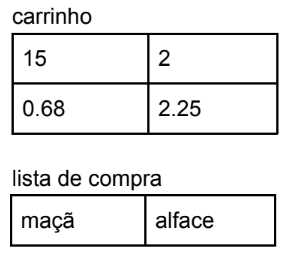
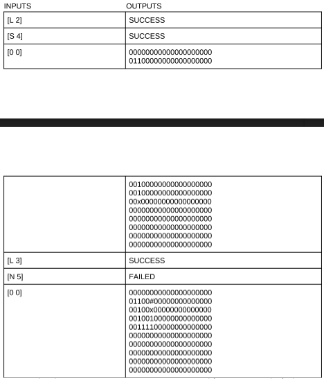

## Exercicios do 3 semestre de Laboratório de Programação em C

### Desafio 1:

Objetivo
Simular um carrinho de compras virtual a partir do uso de técnicas de vetores e matrizes de
dados.
Contexto
O usuário do programa deve acessar menus de delivery e escolher produtos e quantidades
que deseja para a entrega.
O programa deve então disponibilizar uma sequência de menus para a escolha do usuário
sempre observando a capacidade máxima de armazenamento do carrinho de compras. Ao
final do programa informar o extrato da compra com o valor total.
Menu de compras
Vamos dividir o menu nas seguintes seções:
1. Frutas
a. Banana R$3.50 (12 itens)
b. Maçã R$0.68 (30 itens)
c. Uva R$1.99 (58 itens)
2. Verduras
3. Legumes
4. Proteínas
a. Carne
b. Peixe
c. Frango
5. Congelados
6. Bebidas
7. Bebidas alcoólicas
8. Panificadora
O menu 1. Frutas é um exemplo de como você deverá criar as demais opções para
o seu programa com os limites de no mínimo 3 e no máximo 5 itens diferentes por
seção. Se quiser, pode criar sub-seções como o caso do menu 3. Proteínas.
Caso escolha efetuar uma compra então o usuário deve informar qual item ele
deseja e em qual quantidade, em seguida os itens são colocados no carrinho virtual.
Importante: o usuário tem direito a fazer quantas compras por seção desejar.

Desafio xFood
O carrinho de compras
É composto por alocações dinâmicas de memória, uma matriz e um vetor. A matriz deve
servir para armazenar a quantidade de determinado item na linha 0 (primeira linha da
matriz) e seu respectivo valor unitário de compra na linha 1 (linha seguinte). O vetor
representa a lista de compra e deve armazenar o nome de cada item do carrinho. Tanto o
vetor quanto a matriz devem expandir o espaço do carrinho a cada novo item adicionado.
O carrinho tem limite de no máximo 45 itens.
Exemplo:. vamos supor que o usuário no menu 1. Frutas comprou 15 maçãs e no menu 2.
Verduras comprou 2 alfaces (suponha também que exista Alface R$2.25), então teremos

Observe que para as seções seguintes o carrinho ainda terá espaço livre para
mais 28 itens.
Extrato e valor total
Ao final o programa deve informar o extrato total da conta que inicialmente apresenta a
seguinte lista:
● item, valor do item, a quantidade comprada, o valor total da quantidade
Em seguida o extrato deve apresentar os descontos segundo as seguintes regras:
● 5% desconto para frutas acima de 10 itens.
● 7% desconto para verduras e legumes acima de 8 itens.
● A cada 6 bebidas alcoólicas 1 é gratuita.
● Peixes então na promoção de 10% de desconto não importa qual o tipo ou a
quantidade.
Em seguida apresentar o valor do frete:
● o frete para entrega custa R$7.00 mas será gratuito para compras de valor a partir
de R$75.00.
Ao final informar o valor total da conta.

### Desafio 2:

Acesso Remoto - Sonda Espacial
Este programa simula o acesso remoto à navegação de um robô espacial. O Robô que iremos
controlar foi idealizado apenas para mapear áreas planas em superfícies do planeta Marte para
facilitar pousos de futuros equipamentos terrestres.
Configurações
A programação conta com um atributo para a memória de máquina intitulado platô
representado por uma matriz 10x20 de inteiros iniciados com valor 0 (zero). O robô pode se
movimentar livremente apenas nos sentidos NORTE, SUL, LESTE e OESTE.
A posição inicial do robô é aleatória em relação ao platô.
O controle de navegação será feito remoto por console, onde o controlador deve inserir códigos
de controle e verificar as possíveis respostas do robô.
Funcionamento geral
Os códigos de controle são:
<abre_colchete>ORIENTAÇÃO<espaço em branco>TOTAL_MOV<fecha_colchete>
Onde,
ORIENTAÇÃO → é um dígito N, S, L ou O (norte, sul, leste ou oeste).
TOTAL_MOV → é o total de espaço que devem ser caminhados dentro do platô.
Retorno:
Como retorno o robô envia para o display SUCCESS ou FAILED para resultados
positivos e negativos respectivamente.
Comando especial para exibir no display o platô no formato linha x coluna.
<abre_colchete><zero><espaço em branco><zero><fecha_colchete>
Memorização
A principal tarefa do robô é memorizar áreas planas em sua memória representada pelo platô.
A memorização é codificada por:
0 → para áreas não visitadas
1 → para áreas planas
# → para áreas não planas (áreas de obstáculo).
x → para a posição atual do robô

Exemplo de uma navegação ocorrendo em tempo real, supondo posição inicial 1x1

No Exemplo acima, ao tentar mover 5 casas para o norte o robô encontrou um obstáculo no
terceiro movimento e por isso mapeou a área com # e parou um movimento antes do
obstáculo.
OBS:. para realização de testes você deve gerar o total de 50 áreas aleatórias de
obstáculos com o cuidado de não repetir nenhuma área já ocupada incluindo a posição
inicial do robô.

### Desafio 4:

Regras fundamentais: 
Regra 1# As funções devem ser escritas em arquivo separado do arquivo main.c
Regra 2# Criar um programa que contenha uma lista encadeada armazenar elementos do tipo Filme.
	- Código (valor único gerado dinamicamente)	
	- titulo
	- ano
	- gênero

Criar as seguintes funções:
1)Adicionar novo filme
	Ao adicionar um novo filme devemos gerar seu código 
	202001 <-- este eh o primeiro código gerado os demais serão sempre o código atual +1
	202002
	202003
	...
2)Remover filme
3)Atualizar filme (não atualizar o registro de código)
4)exibir total de filmes cadastrados
5)exibir total de determinado gênero
6)buscar informações por de filme pelo código
7)buscar informações por de filme pelo gênero
8)exibir o filme mais antigo	

### Desafio 5:

Orientações sobre o quadro de pontuação:

Cada um deverá desenvolver um sistema segundo a linguagem de programação da disciplina para criar um sistema com interação do usuário bem divida segundo a orientação Front-end e Back-end. O tema do projeto é LIVRE e cada equipe deve se concentrar em idealizar um projeto que relacione de forma pertinente os seguintes itens a seguir:

composição de dados implementados com registros (STRUCTS).
//Estes registros devem conter as informações mais relevantes do seu programa.

escreva toda a lógica de backend do programa em arquivos diferentes do aquivos principal (main.c).
//Escreva funções com os principais recursos do seu sistema.

usar persistência de dados em arquivos.
//GRAVAR, LER, BUSCAR e ALTERAR dados em arquivos.

usar alocação dinâmica de memória.
